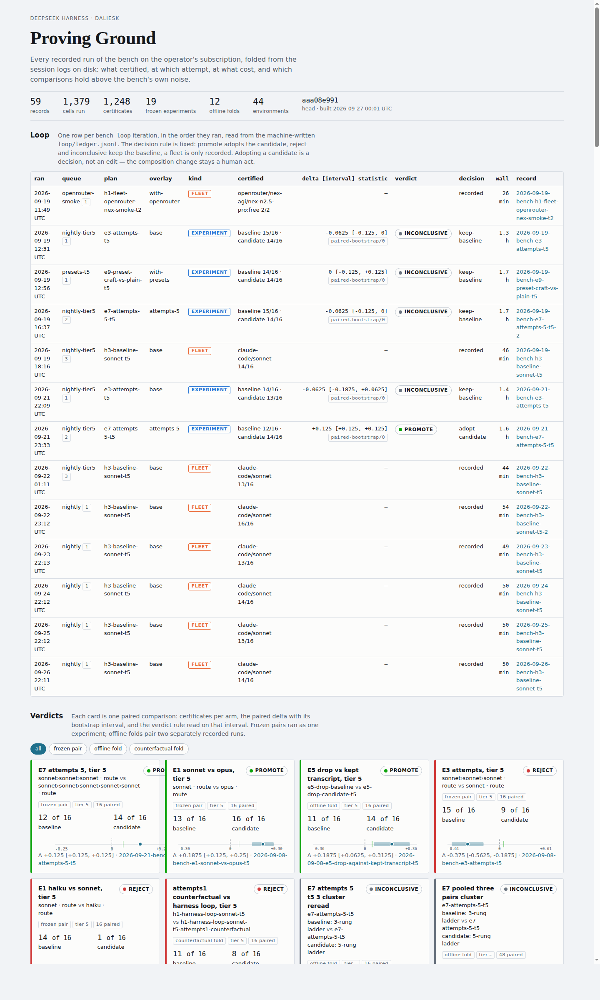

# Daliesk

English | [中文](README.zh.md)

Daliesk is a pilot organisation of AI agents that changes a codebase through a ticket queue, has an independent reviewer approve each change before it ships, and records every step in this repository. [Command deck](https://lbjlincoln.github.io/deepseek-harness/) · [briefing](https://lbjlincoln.github.io/deepseek-harness/briefing/) · [executive summary](docs/client/daliesk-executive-summary.md) · [data handling](docs/client/data-handling.md)

**Provenance.** This repository, [LBJLincoln/deepseek-harness](https://github.com/LBJLincoln/deepseek-harness), is a fork of [deepseek-ai/deepseek-harness](https://github.com/deepseek-ai/deepseek-harness), the open-source agent harness DeepSeek AI develops. The GitHub account LBJLincoln operates Daliesk on that harness: the enterprise, the command deck, the Proving Ground and the code-safety review were written in this fork, on the branch `claude/coding-agent-harness-u9l4gt`, and DeepSeek AI has not built, reviewed or endorsed them. The harness keeps its own name, its `@deepseek-ai/dsh-*` packages and its [MIT licence](LICENSE).

## What the records show

Every figure here is read from [`data/enterprise/roster.json`](data/enterprise/roster.json) as stamped at 2026-09-29 07:07 UTC and from the 141 lines of [`ledger.jsonl`](data/enterprise/ledger.jsonl) it counts, as [`enterprise.json`](apps/command-deck/public/fixtures/enterprise.json) publishes them; the window is the 24 hours before that stamp. The command deck shows the current figures with their age, and [the roster's README](data/enterprise/README.md#occupancy) states the counting rules.

| Delivered in the window | Count |
| --- | --- |
| Tickets shipped as a reviewed commit on the branch | 3 |
| Tickets a model worked that shipped nothing | 3 |
| Tickets halted before any model ran (a shift could not prepare its worktrees) | 4 |
| Code-safety review seats that passed: six departments and the lead, in one review of this repository | 7 of 7 |
| Intake coordinators that passed, each turning requests into queued tickets | 2 of 2 |
| Automated checks that passed: `verify-*` gates, Branch CI verdicts, session folds | 105 of 114 |

| Seats | Count | Rule |
| --- | --- | --- |
| Defined | 147 | a role this repository defines; a definition is not a running agent |
| Occupied, with evidence | 53: 27 model-driven, 22 automated checks, 4 only halted before any model ran | a recorded session or ledger line names the seat |
| Active in the window | 44: 18 model-driven, 22 automated checks, 4 halted before any model ran | one of those deliverables is dated inside the window |

**Which models ran.** Every enterprise ticket line records `Claude Code sonnet` or no model at all, and every intake and code-safety review ran on Claude Code. Of the 1,912 sessions recorded under `data/proving-ground` and `data/code-safety`, 1,283 ran on Claude Code, 29 ran free open-weight models through OpenRouter in the Proving Ground bench, and 600 made no model request. The roster defines 74 seats for the DeepSeek API route and 25 for Codex; no recorded session has run on either.

## DeepSeek Harness

DeepSeek Harness (`dsh`) is an open-source agent harness developed by [DeepSeek AI](https://deepseek.com).

It uses an architecture where **everything is a plugin**, and is powered by [Cordis](https://github.com/cordiverse/cordis), whose design is described in [_A Programming Paradigm for Spatiotemporal Composability_](https://github.com/cordiverse/paper).

## Developer preview

DeepSeek Harness is currently in _developer preview_ and is iterating rapidly. **THERE WILL BE COMPATIBILITY-BREAKING CHANGES.**

## Run

### Run from `npm`

Install `Node.js`, then run:

```sh
npx @deepseek-ai/dsh web
```

The command starts the Web UI, served at `http://127.0.0.1:3080` by default. See [Web UI guide](docs/user/guide/index.md).

### Run from source

To run from a checkout of this fork, which carries the Proving Ground, code-safety and enterprise commands below (the upstream harness alone is at `https://github.com/deepseek-ai/deepseek-harness.git`):

```sh
git clone --branch claude/coding-agent-harness-u9l4gt https://github.com/LBJLincoln/deepseek-harness.git
cd deepseek-harness
pnpm install
pnpm run build
pnpm dsh web
```

## Proving Ground

The harness measures itself on the Proving Ground: a bench of 44 environments across six domains — forty single-file programs and a four-task pilot tier of multi-file repositories — its two hardest tiers validated on hidden cases the implementer never sees, run as frozen paired experiments with bootstrap intervals. [data/proving-ground/dashboard.html](data/proving-ground/dashboard.html) is the one page folded from every recorded run: the verdict of each paired comparison with its interval, the models on the sealed tier, the certification matrix, the timeline, and the training-corpus fold. The [results note](.agents/notes/proposed/architecture/2026-09-08-hypothesis-program-results.md) states what those runs proved and refuted, and [data/proving-ground/improvement-log.md](data/proving-ground/improvement-log.md) is the ledger of the loop itself: one row per improvement iteration, from the change proposed to the decision the verdict earned it. The bench runs on the operator's own Claude Code login and, through the `with-openrouter` overlay, on free open-weight models: three of them certified 16 of 18 tier-2 cells on 2026-09-19, and `pnpm run bench -- loop` recorded its first five iterations without a hand on them, two of them replications of frozen pairs.



After `pnpm run build`, list the checked-in plans, run one frozen paired experiment from them, or run one task through the harness on your own Claude Code login with no API key:

```sh
pnpm run bench -- plans
pnpm run bench -- experiment e3-attempts-t5
pnpm dsh --profile claude-code "Create hello.txt containing the single line hello."
```

## Code safety

The same program workflow reviews an application's source for security defects: six departments read the target in parallel, each in its own worktree and session, run the static scanner and the dependency audit, and write findings with a file, a line and the exact text at that line; an integration merges them into a report with a French executive summary first, and a committed examiner refuses any finding whose cited line does not hold. A finding the examiner passed is **line-verified**: the quoted text is at the cited line of the cited file, which does not show that the finding is a real or exploitable defect. Recall counts a documented issue as found when a finding cites its file within three lines of the issue. Twelve reviews of OWASP NodeGoat, an intentionally vulnerable training application with 18 documented issues, certified every department each time: the ten without the diagnosed checklists found 13 to 15 of the 18 (mean 14.0) and released 38 to 57 line-verified findings in 1,225 to 1,636 s; the two with them found 18 of 18, an in-sample reading because those checklists were written from this target's misses, and released 70 and 49 findings in 1,730 and 1,559 s. One review of dvja, a Java Struts 2 training application, found 13 of its 14 documented issues. Two NodeGoat reviews three hours apart matched 38 of the first run's 42 findings with a second-run finding within three lines of the same file, 31 of them with the same CWE. On a seeded copy of this repository's own code the review caught 6 of 8 planted defects within three lines, 95% interval [0.409, 0.929]; its triage found the other 4 findings to be false positives and a defect the review missed ([the records](data/code-safety/README.md)). The [command deck](apps/command-deck/README.md) shows the 147 seat definitions with what their recorded deliverables show, the process, and the findings on the target's code, live from the [feed](data/enterprise/README.md) or replayed from fixtures; [the runbook](docs/code-safety-poc.md) is the demonstration script, and [data handling](docs/client/data-handling.md) states where a reviewed codebase and its records go: to Anthropic's model API under the operator's Claude Code login, and into this public repository when a review is recorded.

```sh
pnpm run code-safety -- /path/to/target --model sonnet   # a review on your Claude Code login
pnpm run poc                                             # the feed on :4711 and the production deck on :3000
```

## Community and support

- Feel free to submit feedback or bug reports through [GitHub Discussions](https://github.com/deepseek-ai/deepseek-harness/discussions).
- Add the [`dsh-plugin`](https://github.com/topics/dsh-plugin) topic to your plugin repository for discoverability.
- Join <a href="https://discord.gg/Ycq5dCaS4">DeepSeek Harness Discord community</a>.

## Contributing

See [CONTRIBUTING.md](CONTRIBUTING.md).

## Development

Start with the [development guide](docs/development.md) and [architecture documentation](docs/architecture.md).

For agents, follow [AGENTS.md](AGENTS.md).

## License

[MIT](LICENSE)

Third-party dependencies and their licenses are disclosed in [THIRD_PARTY_NOTICES.md](THIRD_PARTY_NOTICES.md).
