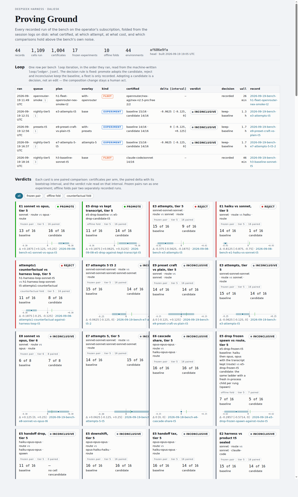

# DeepSeek Harness

[English](README.md) | 中文

DeepSeek Harness（`dsh`）是由 [DeepSeek AI](https://deepseek.com) 开发的开源 agent harness（智能体框架）。

它采用**一切皆插件**的架构，并由 [Cordis](https://github.com/cordiverse/cordis) 驱动，其设计参见论文 [_A Programming Paradigm for Spatiotemporal Composability_](https://github.com/cordiverse/paper)。

## 开发者预览

DeepSeek Harness 目前处于 _开发者预览_ 阶段，正在快速迭代。**未来将出现破坏兼容性的变更。**

## 运行

### 通过 `npm` 运行

安装 `Node.js`，然后运行：

```sh
npx @deepseek-ai/dsh web
```

该命令会启动 Web UI，默认地址为 `http://127.0.0.1:3080`。详见 [Web UI 指南](docs/user/guide/index.md)。

### 从源码运行

如需从仓库源码运行：

```sh
git clone https://github.com/deepseek-ai/deepseek-harness.git
cd deepseek-harness
pnpm install
pnpm run build
pnpm dsh web
```

## Proving Ground

harness 在 Proving Ground 上度量自身：这是一个横跨六个领域、由 44 个环境组成的 bench —— 四十个单文件程序，外加一个由四个多文件仓库任务构成的试点层 —— 其最难的两档由 implementer 从未见过的隐藏用例验证，并以带 bootstrap 区间的冻结配对实验运行。[data/proving-ground/dashboard.html](data/proving-ground/dashboard.html) 是由每一条已记录运行折叠而成的那一个页面：每组配对比较的判定及其区间、密封层级上的各模型、认证矩阵、时间线，以及训练语料折叠。[结果笔记](.agents/notes/proposed/architecture/2026-09-08-hypothesis-program-results.md)陈述这些运行证明了什么、驳倒了什么，而 [data/proving-ground/improvement-log.md](data/proving-ground/improvement-log.md) 是这个循环本身的台账：每次改进迭代一行，从被提出的改动到裁决为它挣得的决定。这个 bench 跑在操作者自己的 Claude Code 登录上，也经 `with-openrouter` 叠加层跑在免费的开放权重模型上：2026-09-19 其中三个模型认证了第 2 层 18 个 cell 中的 16 个，而 `pnpm run bench -- loop` 无人插手地记录了它的前五次迭代，其中两次是对冻结配对的复现。



执行 `pnpm run build` 之后，可以列出已签入的计划、从中运行一组冻结配对实验，或在你自己的 Claude Code 登录上、无需 API key 地通过 harness 运行一个任务：

```sh
pnpm run bench -- plans
pnpm run bench -- experiment e3-attempts-t5
pnpm dsh --profile claude-code "Create hello.txt containing the single line hello."
```

## 社区与支持

- 欢迎通过 [GitHub Discussions](https://github.com/deepseek-ai/deepseek-harness/discussions) 提交反馈或 bug 报告。
- 为你的插件仓库添加 [`dsh-plugin`](https://github.com/topics/dsh-plugin) 话题，便于被发现。
- 欢迎加入 DeepSeek Harness 企微群：扫码添加企微小助手并填写入群问卷，完成后小助手会邀请你入群。

<table>
  <thead>
    <tr>
      <th align="center">企微小助手</th>
      <th align="center">入群问卷</th>
      <th align="center">微信公众号</th>
    </tr>
  </thead>
  <tbody>
    <tr>
      <td align="center"></td>
      <td align="center"><a href="https://trtgsjkv6r.feishu.cn/share/base/form/shrcnIt5twSVdLGD52KJBckGCgg"></a></td>
      <td align="center"></td>
    </tr>
  </tbody>
</table>

## 参与贡献

参见 [CONTRIBUTING.md](CONTRIBUTING.md)。

## 开发

请先阅读[开发指南](docs/development.md)与[架构文档](docs/architecture.md)。

面向 agent：请遵循 [AGENTS.md](AGENTS.md)。

## 许可证

[MIT](LICENSE)

第三方依赖及其许可证见 [THIRD_PARTY_NOTICES.md](THIRD_PARTY_NOTICES.md)。
