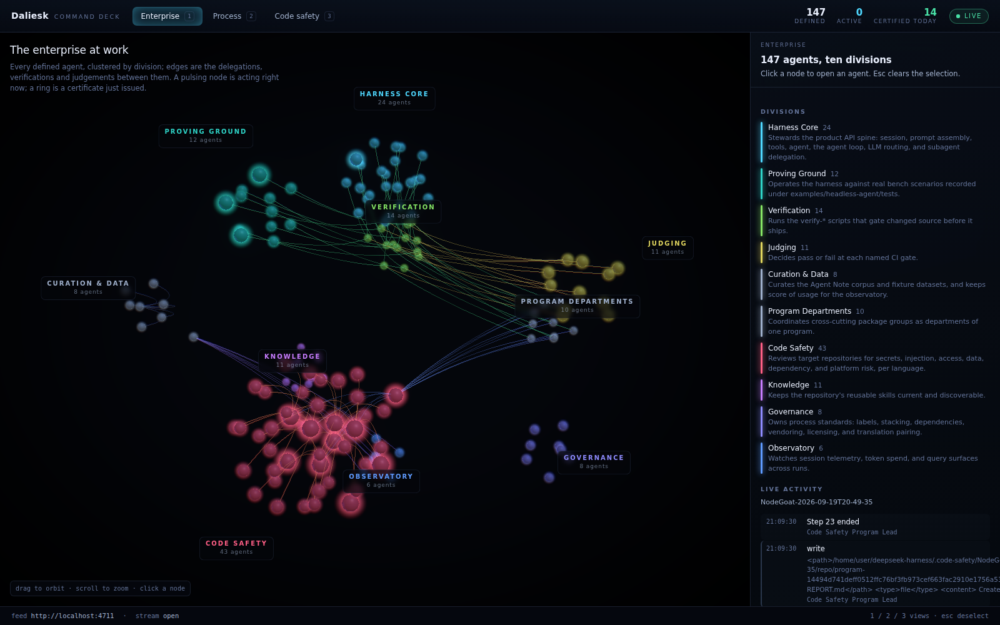
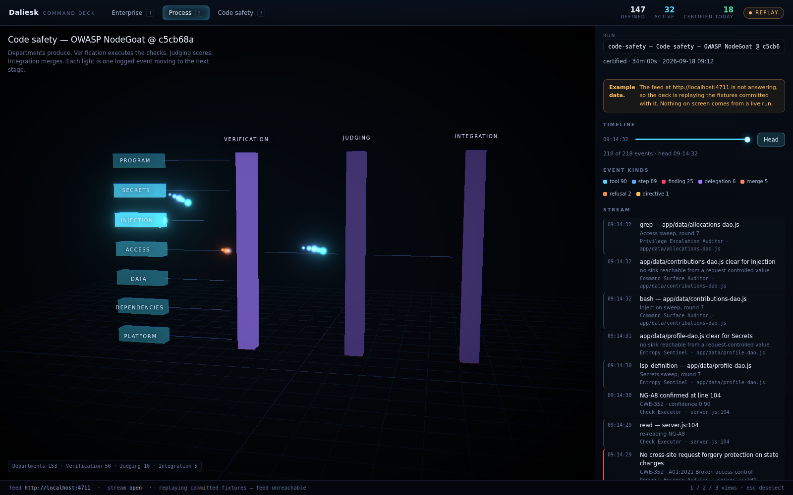
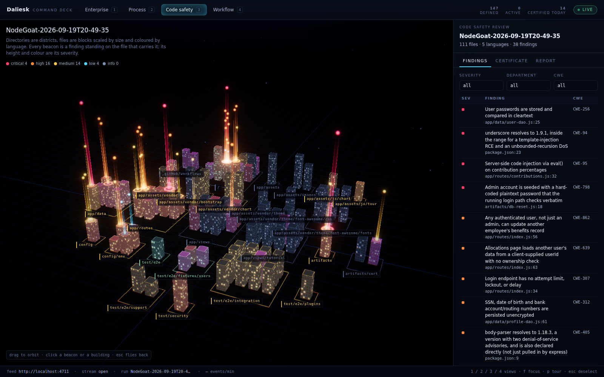

# @deepseek-ai/dsh-command-deck

English | [中文](README.zh.md)

The Command Deck is the customer-facing front end of the Daliesk agent enterprise: 147 defined agents, the workflows between them, the live activity of a harness run, and a code-safety review placed on the target repository's own code.

It is a Next.js 14 application (App Router, React 18) whose three scenes are three.js through `@react-three/fiber`. It reads one HTTP feed and, when that feed does not answer, replays the fixtures committed beside it — so the deck is fully usable, and demonstrable, with no server running and no API key.

## Run it

Run the first from the repository root; the second is `pnpm --dir apps/command-deck dev` under another name.

```sh
pnpm install
pnpm run deck
```

The deck serves on `http://localhost:3000`. Point it at a live feed with `NEXT_PUBLIC_FEED_URL`; the default is `http://localhost:4711`.

The second line is the production build and the server over it; the third regenerates `fixtures/`.

```sh
NEXT_PUBLIC_FEED_URL=http://localhost:4711 pnpm run deck
pnpm --dir apps/command-deck build && pnpm --dir apps/command-deck start
pnpm --dir apps/command-deck fixtures
```

## The three views

| Key | View | What it shows |
| --- | --- | --- |
| `1` | **Enterprise** (`/`) | Every defined agent as a node, clustered by division, edges for the delegations, verifications and judgements between them. A node pulses while its agent acts; a ring bursts where a certificate is issued. Clicking one opens its role, model route, preset, skills, tools, source file, and its own events in the run being followed. |
| `2` | **Process** (`/process`) | The program pipeline — departments, Verification, Judging, Integration — with every logged event travelling as a comet from its stage to the next. A timeline scrubber replays the run from any point; `Head` returns to live. |
| `3` | **Code safety** (`/safety`) | The reviewed repository as a code city: directories are districts, files are blocks scaled by size and coloured by language, and every finding is a marker standing on the line of code that carries it. The panel holds the findings table with severity, department and CWE filters, the certificate with its counts and its unverified list, the bilingual report, downloads, and the form that starts a new review. |

`Esc` clears the selection. `prefers-reduced-motion: reduce` turns off the auto-orbit, the pulsing and the chromatic aberration, and holds bloom at a constant intensity.







## The feed contract

The deck reads `NEXT_PUBLIC_FEED_URL` (default `http://localhost:4711`) and expects these paths. The feed server itself is not in this package.

| Path | Answer |
| --- | --- |
| `GET /roster` | `{ generatedAt, counts: { defined, active }, divisions[], agents[], edges[] }` — the 147 agents, their divisions and their relationships. |
| `GET /runs` | `[{ id, kind, name, startedAt, endedAt?, status, path }]` for every `program`, `fleet`, `experiment` and `code-safety` run. |
| `GET /runs/:id/events` | Server-Sent Events. Each `data:` frame is one `{ ts, seq, agentId, sessionId, kind, label, detail?, severity?, file?, line? }`. The stream replays history and then stays open. |
| `GET /safety/:id` | `{ target, departments, findings, certificate, report }` for one code-safety review. |
| `POST /safety` | `{ target, model? }` starts a review and answers `{ id }`; the deck then follows that run live. |

Every field is typed in [`deck/contract.ts`](deck/contract.ts), which is the one place the contract is written down. `seq` is what the client deduplicates on, so a reconnection that replays history delivers nothing twice.

Two deck-side rules are worth knowing because the feed does not carry them. A finding's owning department is derived from its CWE through the table in [`deck/departments.ts`](deck/departments.ts), since the feed reports per-department totals but places no department on the finding itself. A finding counts as verified unless the certificate's `unverified` list names it.

## Replay: what happens with no feed

On load the deck sends one `GET /roster` to the configured feed with a 1.5-second timeout. Any failure — connection refused, timeout, non-2xx, a blocked cross-origin request — selects replay mode, and every later read goes to the deck's own routes under `/api/fixtures`, which serve the same paths with the same payloads. The header badge reads `REPLAY` instead of `LIVE`, the status footer names the feed it could not reach, and each view carries a standing **Example data** notice, so a screenshot cannot be mistaken for a live run.

The replayed event stream is paced rather than dumped: the route delivers the first 60% of the recording immediately as history, then releases the rest a frame at a time, then holds the connection open. A keyless demo therefore shows an enterprise at work rather than a static file.

`POST /safety` in replay mode reopens the recorded review instead of starting a new one, and says so under the form.

## The fixtures

`fixtures/` is generated by `scripts/generate-fixtures.ts` from one seeded PRNG, so regenerating produces byte-identical files.

- `fixtures/roster.json` — 147 agents across ten divisions (Harness Core, Proving Ground, Verification, Judging, Curation and Data, Program Departments, Code Safety with its six departments, Knowledge, Governance, Observatory) and 424 relationships. The division sizes and the members are written down in `scripts/roster-source.ts`.
- `fixtures/runs.json` — one code-safety run, one program, one fleet shift, one paired experiment.
- `fixtures/events/<run>.jsonl` — the recorded streams; the code-safety run holds just over three hundred events, from the opening directive through six departments sweeping the tree in parallel, findings landing, the verifier re-reading each one at its line, judging, integration, and the certificate.
- `fixtures/safety/<run>.json` — the review: 34 files, 26 findings, the department roll-up, the certificate with its two named unverified findings, and the report in French and English.

The code-safety findings are not invented. Eighteen of the twenty-six are read from [`data/code-safety/targets/nodegoat.ground-truth.json`](../../data/code-safety/targets/nodegoat.ground-truth.json), this repository's own ground truth for OWASP NodeGoat at revision `c5cb68a`, with their real CWE, file and line. The remaining eight are departmental output beyond that ground truth and carry lower confidence to match.

## Layout

| Directory | Holds |
| --- | --- |
| `app/` | The routes, and the fixture endpoints under `app/api/fixtures/`. |
| `components/` | The shell, and one folder per view; everything touching three.js is a Client Component. |
| `deck/` | The contract, the feed client, the event stream, the store, the layouts, the palette. |
| `fixtures/` | The committed replay data. |
| `scripts/` | The fixture generator and its roster source. |
| `docs/` | The screenshots above. |

The shell (`app/layout.tsx`) is a Server Component. Each scene is loaded through `next/dynamic` with `ssr: false`, because three.js reaches for a WebGL context on mount.

## Limitations

The deck reads; it never writes to a repository and never runs a review itself — `POST /safety` asks the feed to. A live feed on another origin must send CORS headers the browser accepts, or the deck falls back to replay. The scenes need WebGL 2; there is no 2D fallback. The code city places a finding only when the target's file list contains its `file`, and a finding on a file the feed did not report is listed in the table but carries no marker.
