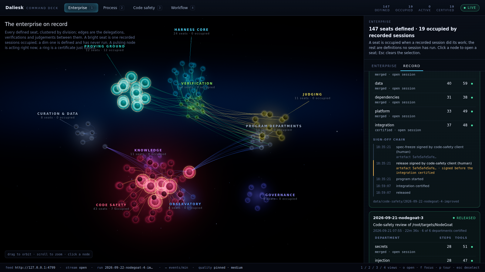
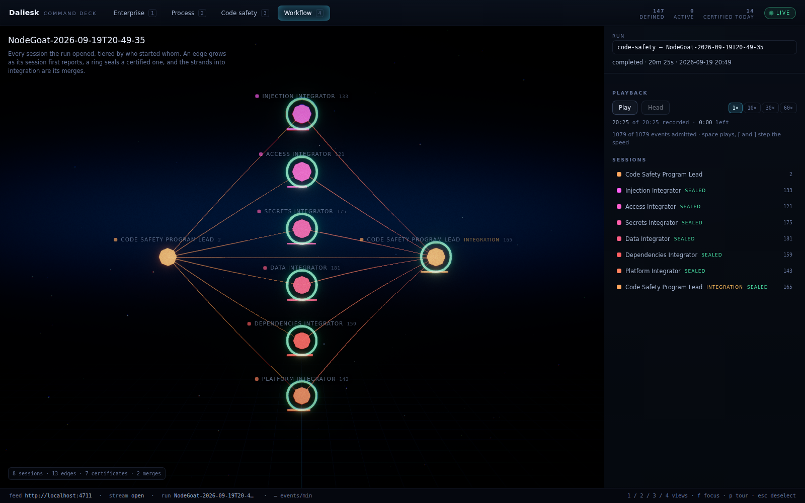

# @deepseek-ai/dsh-command-deck

English | [中文](README.zh.md)

The Command Deck is the customer-facing front end of the Daliesk agent enterprise: its 147 seat definitions, each with the evidence the recorded sessions give it; the organisation of record, every recorded program run with its departments, certificates and sign-offs; the workflows between sessions; the live activity of a harness run; and a code-safety review placed on the target repository's own code.

It is a Next.js 14 application (App Router, React 18) whose three scenes are three.js through `@react-three/fiber`. It reads one HTTP feed and, when that feed does not answer, replays the fixtures committed beside it — so the deck is fully usable, and demonstrable, with no server running and no API key.

## Run it

Run the first from the repository root; the second is `pnpm --dir apps/command-deck dev` under another name.

```sh
pnpm install
pnpm run deck
```

The deck serves on `http://localhost:3000`. Point it at a live feed with `NEXT_PUBLIC_FEED_URL`; the default is `http://localhost:4711`. A viewer can also name a feed for one browser tab with `?feed=https://feed.example` on the deck's URL; the tab keeps it across views and reloads, so a hosted deck follows any feed the browser can reach without a rebuild.

The second line is the production build and the server over it; the third snapshots `public/fixtures/` from a running feed.

```sh
NEXT_PUBLIC_FEED_URL=http://localhost:4711 pnpm run deck
pnpm --dir apps/command-deck build && pnpm --dir apps/command-deck start
pnpm --dir apps/command-deck fixtures
```

`DECK_STATIC=1 pnpm --dir apps/command-deck build` writes the same views as a static export under `apps/command-deck/out/`: every view is a Client Component over static fixtures, so the export is the whole deck in replay mode, and `NEXT_PUBLIC_BASE_PATH` sets the path prefix it is served under. [`deck-pages.yml`](../../.github/workflows/deck-pages.yml) builds that export on every push of the deck's branch and publishes it to the repository's GitHub Pages site, <https://lbjlincoln.github.io/deepseek-harness/>: the demo URL that needs no feed, no key and no machine. A page served there still probes the configured feed first, and a browser refuses `http://localhost:4711` from an `https` page, so it lands in replay within a second. While the operator's machine pushes to the [mirror](mirror/README.md), the same page is live: the workflow bakes the relay in as the page's feed, and `?feed=` names another.

## The four views

| Key | View | What it shows |
| --- | --- | --- |
| `1` | **Enterprise** (`/`) | Every defined seat as a node, clustered by division inside a soft nebula in the division's colour; edges are the delegations, verifications and judgements between them. A seat a recorded session occupied burns at full strength; a seat no recorded session occupied is drawn dim, and hovering it says `defined, never run`. Traffic runs along an edge only while one of its two seats has acted in the last few seconds, coloured by the relationship's kind; with nothing live the edges only breathe. A seat at work wears a turning orbital ring, a certified seat a warm rim, a failed one a dim red rim, and a certificate lands as an expanding ring with a short beam of light. Clicking a node flies the camera to it, dims everything unrelated, and opens its role, the route it is defined for beside the routes its sessions ran on, its recorded sessions, preset, skills, tools, source file and its own events in the run being followed; `Esc` flies back. The panel's headline is `<n> seats defined · <m> occupied by recorded sessions`, read from the roster's evidence. Its Enterprise tab lists the routes by the sessions recorded on each (a route seats are defined for and no session ran on reads `defined for N seats, never run`), the sessions no seat holds with the reason, and each division's occupied and defined counts. Its Record tab is the organisation of record from `GET /programs`: each recorded program run with its departments, their steps, tool calls and certificates, the integration's verdict, and the sign-off chain in the order the record logged it, marking a release signed before the integration certified; a department row opens its session in the Workflow view when the deck lists the run. |
| `2` | **Process** (`/process`) | The program pipeline as a lit corridor: each department lane is a glowing rail in its division's colour, running from the left edge through three tall glass gates, Verification, Judging and Integration, over a floor grid that recedes into the fog. Every logged event travels its lane as a comet with a ribbon trail, sized and coloured by kind; a certificate rings the Verification gate, a merge lights Integration and leaves it lit. A lane's label names the agent working it and its event count, and brightens while that agent is acting. The camera opens on an establishing move, drifts while the run produces, and pulls back to frame every lane once the run has ended. A timeline scrubber drags a time plane along the pipeline; `Head` returns to live. |
| `3` | **Code safety** (`/safety`) | The reviewed repository as a code city at night: directories are districts, each floor outlined in the colour of the language most of it is written in, and files are blocks scaled by size whose windows are lit in proportion to the file's bytes, keyed on the path so one file lights the same windows in every render. Every finding stands a shaft of light on the roof of its file, tallest and brightest for critical and shortest for info, with a breathing halo at its foot; hovering one names the file, the line and the finding, and selecting one flies the camera onto its building and hangs a callout on the shaft. While any department of the loaded review is still pending, a wall of light sweeps the city every few seconds and the district outlines pulse with it; the sweep stops when the last department releases. The panel holds the findings table with severity, department and CWE filters, the certificate with its counts and its unverified list, the bilingual report, downloads, the form that starts a new review, and — for a target with a committed benchmark — a Benchmark tab that scores the enterprise against a scanner and a single frontier model on the same ground truth, with the issue-by-issue matrix and the gaps that comparison hands the improvement loop. |
| `4` | **Workflow** (`/workflow`) | The followed run's own sessions as a directed graph, built from its event stream: the root session on the left, the sessions it started fanned out beside it in the order they first reported, and the session that integrates their work last. An edge grows from parent to child as the child's first frame is admitted, a certificate seals its session with a ring and sends a pulse back up that edge, a merge draws strands from every certified department into integration and lights it, a refusal flashes red and leaves a rim, and a directive lifts the session it was queued in. Each node carries a meter of its event count against the busiest session and dims after thirty seconds without work. Hovering names the session, its id, its event count and its last frame; clicking opens those facts and its last ten events. The camera opens on an establishing shot and re-frames itself as tiers and rows are added under it. |

`Esc` clears the selection and flies each stage back: the enterprise view to the whole graph, the code city to its resting height. The enterprise view opens on an establishing shot, the camera easing in from far out and high above the graph over two and a half seconds; the code city opens on a three-second fly-over from high over its far edge. `prefers-reduced-motion: reduce` opens every view at rest, stops the traffic, the auto-orbit, the pulsing and the chromatic aberration, holds bloom at a constant intensity, and cuts to a selected agent instead of flying; in the process view it holds the camera at one angle over the whole pipeline and stands each event as a still dot on its own rail; in the code city it skips the fly-over, cuts to a selected finding, holds the scan line still at the centre and stops the windows and the halos breathing.

`F` gives the stage the whole frame: the side panel hides and the header keeps only the mark, the counts and the live badge. `P` starts a tour that walks the four views every thirty seconds, opening each with a title card whose two lines are composed from what the deck has read: the seats defined and occupied, the run and its event count, the reviewed target with its findings and whether it is certified, the workflow's sessions, edges, certificates and merges. Any key or click ends the tour. Under `prefers-reduced-motion: reduce` the kinetic title, the route dissolve and the counter tweens are also off; every mode still works.

`O` runs the cold open: the stage goes to black behind the Daliesk mark and one claim line composed only from what the deck has read (seats defined, seats occupied, runs listed), then the enterprise assembles itself division by division in roster order while the header counters climb from zero, and the claim dissolves onto the working deck about eighteen seconds after the key. `P` runs it as the tour's first act, once per page load; a second `P` starts the tour without it. Any key or click ends it at once, with the graph whole rather than half lit, and under `prefers-reduced-motion: reduce` the claim holds for four seconds over a graph already at rest.

`G` on the Code safety view walks the loaded review's twelve worst findings, worst first, four and a half seconds each: the camera flies from beacon to beacon, hangs each callout and the panel opens the finding's card, as a click would. The tour ends after the last finding with the camera flying back, and any other key or a click ends it at once; the panel's eyebrow says `findings tour` while it runs. Like the playback keys, it is bound only while that view is mounted.

The grade steps between three quality tiers as the frame allows: `high` (pixel ratio up to 1.75, SMAA, full bloom), `medium` (1.25, SMAA, a fifth off the bloom) and `low` (1, no SMAA, bloom at 0.8). Two declines in a row drop a tier and four inclines climb one, a tier holds five seconds after any change, and after two drops the tier reached becomes the ceiling, so an unknown laptop adapts once instead of flickering. `?quality=high|medium|low` pins a tier and stops the monitor, which is how the demonstration machine is set after a rehearsal, and the footer says which tier is running and whether it was pinned.

Playback replays a recorded run against its own clock. The transport in the Workflow panel and in the Process view's Timeline section plays from the cursor, or from the run's first frame while the deck is following the head, at 1×, 10×, 30× or 60×, and returns to following the head when it reaches the end, so a run still producing carries on live the moment playback catches up with it. `Space` plays and pauses and `[` and `]` step the speed, on whichever of those two views is on screen and never while the viewer is in a control. The two times under the buttons are the recorded span the cursor has passed and the span still ahead of it, not screen time: the twenty-minute NodeGoat review plays in twenty seconds at 60×. Every view reads the same cursor, so the graph builds itself while the pipeline's lanes light in the order they lit, and the process view's launch queue releases at its fixed rate multiplied by the playback speed rather than falling minutes behind the panel beside it.

While a review runs, every file a department opens flares on its own building in that department's colour and fades over about two and a half seconds, with a short pulse running up the tower; the file then keeps a faint tint of that colour, so the city fills in as the review reads it, and the panel counts `N of 111 files opened` from the same resolution, a tool event's paths matched against the target's inventory by longest path suffix (on the recorded NodeGoat review that resolves 124 of 634 tool events to 51 of the 111 files). A review that starts while the deck is watching opens on an eight-second launch sequence in which the six departments ignite one after another with what each one reads the code for. A review that reaches its certificate while the deck is watching plays a ten-second verdict, CERTIFIED or NOT CERTIFIED, with the departments that certified, the examiner the certificate names and its severity counts, over a ground ring that travels out from the city centre and bursts each beacon as it passes; a review loaded in its final state plays neither, because nothing happened while anyone was watching. Under `prefers-reduced-motion: reduce` the city holds a steady highlight on the last file touched alone, the launch sequence is one static card, and the verdict is the card without the ring or the burst. The six departments are one colour everywhere: the process lanes and the city's read trail both take it from the palette.







## The feed contract

The deck reads `NEXT_PUBLIC_FEED_URL` (default `http://localhost:4711`) and expects these paths. The feed server itself is not in this package.

| Path | Answer |
| --- | --- |
| `GET /roster` | `{ generatedAt, counts: { defined, occupied, active }, divisions[], agents[], edges[], evidence, unattributed }` — the 147 seats, each with its evidence (`sessions`, `lastSeen`, `routesSeen`), their divisions and relationships, the records the evidence was read from with the sessions per route, and the sessions no seat holds, by reason. |
| `GET /runs` | `[{ id, kind, name, startedAt, endedAt?, status, path }]` for every `program`, `fleet`, `experiment` and `code-safety` run. |
| `GET /programs` | `[{ programId, runId, kind, path, target?, spec?, startedAt, endedAt?, outcome?, departments[], integration?, signoffs[] }]` — the organisation of record: every recorded program run, newest first, with each department's session, status, certificate, steps and tool calls, the integration's verdict, and every signature with its time and `decidedBy`. |
| `GET /runs/:id/events` | Server-Sent Events. Each `data:` frame is one `{ ts, seq, agentId?, sessionId, kind, label, detail?, severity?, file?, line? }`; `agentId` is the seat the frame's session occupies and is absent when no rule places the session on a seat. The stream replays history and then stays open. |
| `GET /safety/:id` | `{ target, departments, findings, certificate, report }` for one code-safety review. |
| `POST /safety` | `{ target, model? }` starts a review and answers `{ id }`; the deck then follows that run live. `target` is an absolute path on the feed's machine and `model` is `sonnet` or `opus`, the names `pnpm run code-safety -- --model` accepts; the form opens on the loaded review's own target. |

Every field is typed in [`deck/contract.ts`](deck/contract.ts), which is the one place the contract is written down. `seq` counts from one inside each session the feed folds, so the client deduplicates on the pair of `sessionId` and `seq`, and a reconnection that replays history delivers nothing twice; `ts` is epoch milliseconds, and the timeline cursor is a `ts` cap rather than a sequence number, because sequence numbers from different sessions do not order each other. The footer's events per minute is counted from the `ts` of the frames in the event window over the last sixty seconds: a live feed measures that minute against the wall clock, so a feed that stops reporting decays to `—`; replay measures it against the newest recorded frame, because fixture timestamps are historical. Nothing is extrapolated.

Two deck-side rules are worth knowing because the feed does not carry them. A finding's owning department is derived from its CWE through the table in [`deck/departments.ts`](deck/departments.ts), since the feed reports per-department totals but places no department on the finding itself. A finding counts as verified unless the certificate's `unverified` list names it.

## Replay: what happens with no feed

On load the deck sends one `GET /roster` to the configured feed with a 5-second timeout. Any failure — connection refused, timeout, non-2xx, a blocked cross-origin request — selects replay mode, and every later read goes to the committed fixtures under `public/fixtures`, static files holding the payloads the feed's paths return (`/roster` becomes `/fixtures/roster.json`, a run's event stream becomes `/fixtures/events/<run>.jsonl`). The header badge reads `REPLAY` instead of `LIVE`, the status footer names the feed it could not reach, and each view carries a standing **Example data** notice, so a screenshot cannot be mistaken for a live run.

The replayed event stream is paced rather than dumped: the stream client reads the recording once, delivers the first 55% immediately as history, then releases the rest a frame every 330 ms, then stays open and silent. A keyless demo therefore shows an enterprise at work rather than a static file.

`POST /safety` in replay mode reopens the recorded review instead of starting a new one, and says so under the form.

## The fixtures

`public/fixtures/` is a snapshot of the real feed, taken by `scripts/snapshot-fixtures.ts` (`pnpm --dir apps/command-deck fixtures` with `pnpm run feed` running): nothing in it is invented, and the script refuses a live run directory because only committed records have their key material redacted.

- `public/fixtures/roster.json` — the feed's `GET /roster`: the generated [`data/enterprise/roster.json`](../../data/enterprise/README.md), 147 seats in ten divisions and 124 relationships, with the evidence and statuses the committed records give them: 19 seats occupied, and 1,000 of the 1,380 recorded sessions held by no seat.
- `public/fixtures/programs.json` — the feed's `GET /programs`: the seven recorded program runs, five code-safety reviews and two Proving Ground programs.
- `public/fixtures/runs.json` — five committed records: the two code-safety reviews recorded on 2026-09-19 (the second NodeGoat run, the Java dvja run), a tier-5 fleet, a paired experiment, and the csv-tools program.
- `public/fixtures/events/<run>.jsonl` — each record's session logs folded by the feed into the event stream the deck follows: 1,079 events for the NodeGoat review, from the departments' opening directives through their tool calls to the four certificates and the two merges.
- `public/fixtures/safety/<run>.json` — the feed's `GET /safety/:id` for each review: the NodeGoat review's 111 files and 38 verified findings, the dvja review's 174 files and 40, each with its departments, its certificate and its bilingual report.

The recorded reviews are the same ones [`data/code-safety/README.md`](../../data/code-safety/README.md) reads recall against, so a replay shows exactly what the live run showed.

## Layout

| Directory | Holds |
| --- | --- |
| `app/` | The routes. |
| `components/` | The shell, and one folder per view; everything touching three.js is a Client Component. |
| `deck/` | The contract, the feed client, the event stream, the store, the playback clock, the layouts, the palette. |
| `public/fixtures/` | The committed replay data, served as static files. |
| `scripts/` | The fixture snapshot script. |
| `docs/` | The screenshots above. |

The shell (`app/layout.tsx`) is a Server Component. Each scene is loaded through `next/dynamic` with `ssr: false`, because three.js reaches for a WebGL context on mount.

## Limitations

A run's recorded history reaches the deck in one burst, so the process view releases its comets from a queue at a fixed rate multiplied by the playback speed: every logged event is seen to travel, a few seconds after the panel has already counted it at 1×.

The deck reads; it never writes to a repository and never runs a review itself — `POST /safety` asks the feed to. A live feed on another origin must send CORS headers the browser accepts, or the deck falls back to replay. The scenes need WebGL 2; there is no 2D fallback. The code city places a finding only when the target's file list contains its `file`, and a finding on a file the feed did not report is listed in the table but stands no beacon. At the widest zoom the shared bloom catches the lit windows themselves and softens the city slightly; the grade is one composer for the four views, tuned for the beams and the rails first.
