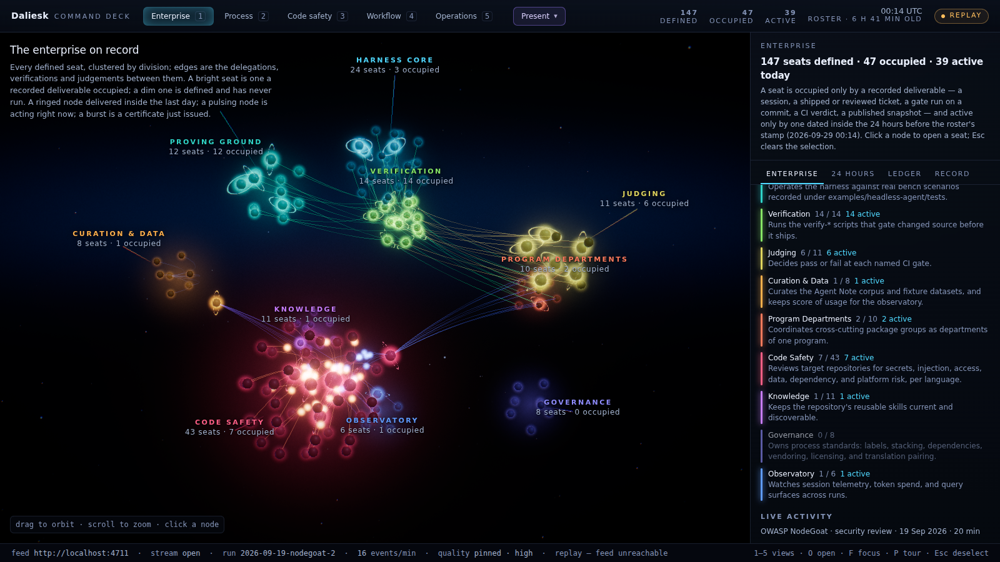
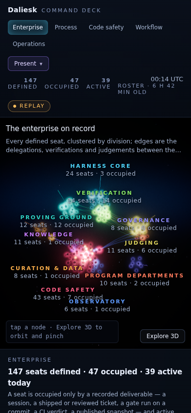
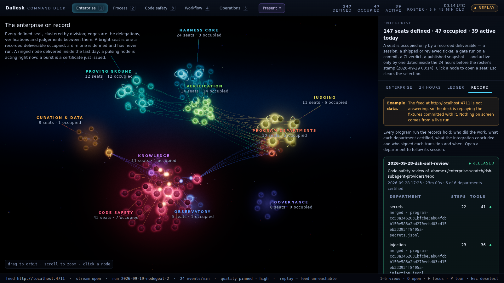
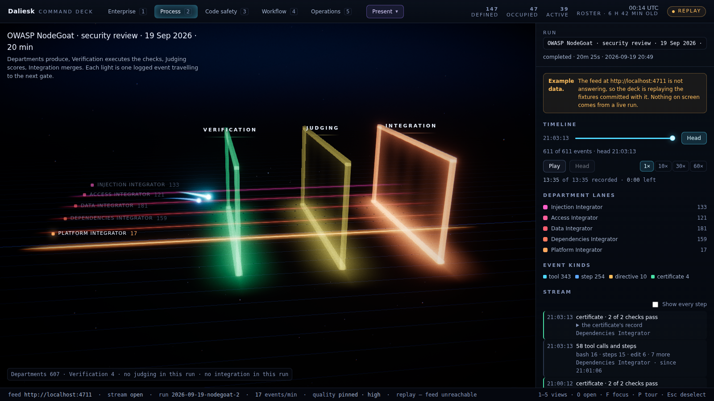
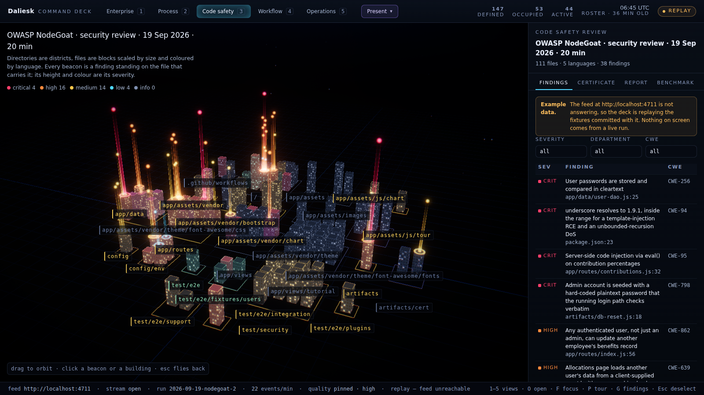
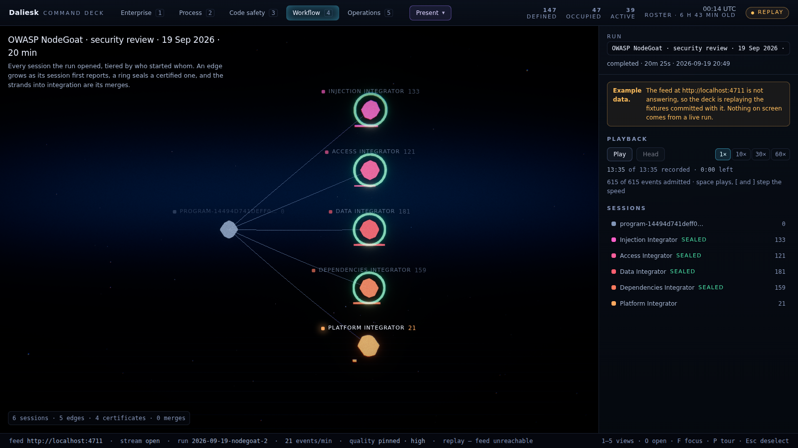
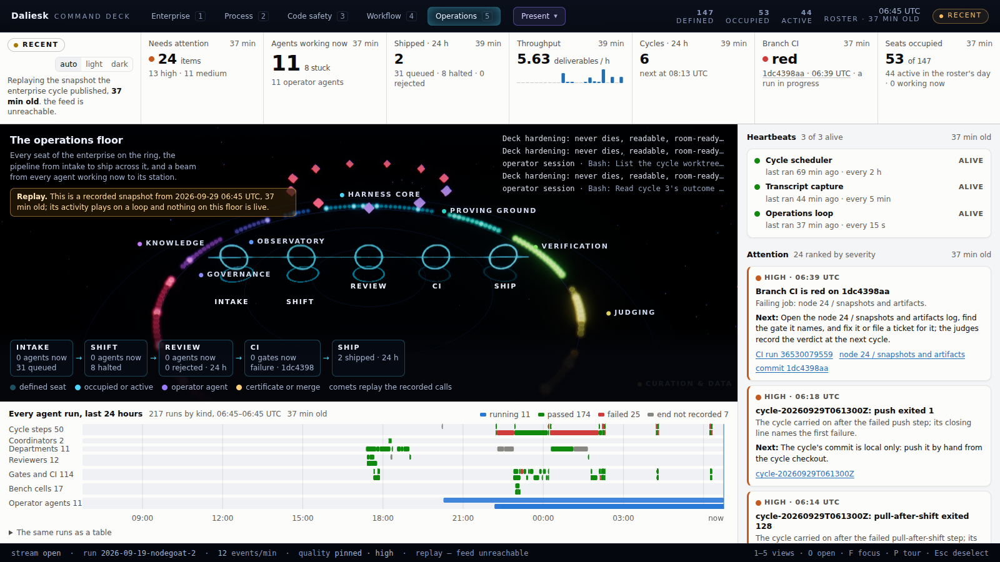
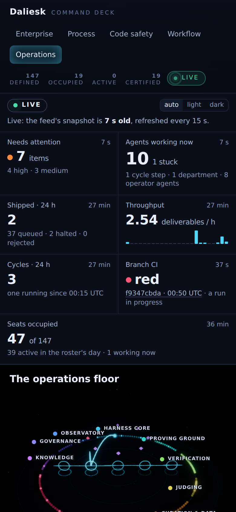
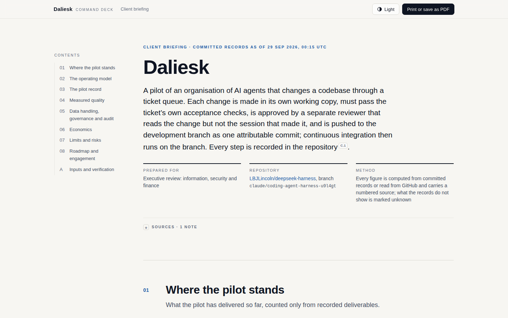
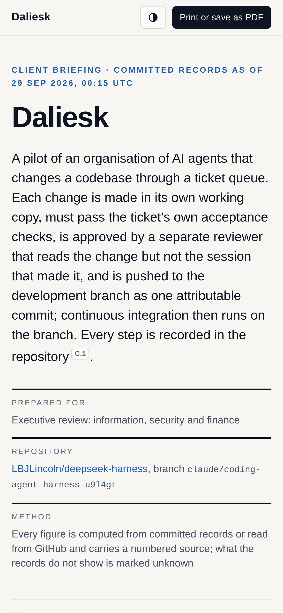

# Daliesk Command Deck

English | [中文](README.zh.md)

The Command Deck, the package `@deepseek-ai/dsh-command-deck`, is the customer-facing front end of Daliesk, a pilot organisation of AI agents built on DeepSeek Harness: its 147 seat definitions, each with the evidence the recorded sessions give it; the organisation of record, every recorded program run with its departments, certificates and sign-offs; the workflows between sessions; the live activity of a harness run; a code-safety review placed on the target repository's own code; and the enterprise's operations, every agent working now with what needs attention and why.

It is a Next.js 14 application (App Router, React 18) whose three scenes are three.js through `@react-three/fiber`. It reads one HTTP feed and, when that feed does not answer, replays the fixtures committed beside it — so the deck is fully usable, and demonstrable, with no server running and no API key.

## Run it

Run the first from the repository root; the second is `pnpm --dir apps/command-deck dev` under another name.

```sh
pnpm install
pnpm run deck
```

The deck serves on `http://localhost:3000`. Point it at a live feed with `NEXT_PUBLIC_FEED_URL`; the default is `http://localhost:4711`. A viewer can also name a feed for one browser tab with `?feed=https://feed.example` on the deck's URL; the tab keeps it across views and reloads, so a hosted deck follows any feed the browser can reach without a rebuild.

The second line is the production build and the server over it; the third snapshots `public/fixtures/` from a running feed.

```sh
NEXT_PUBLIC_FEED_URL=http://localhost:4711 pnpm run deck
pnpm --dir apps/command-deck build && pnpm --dir apps/command-deck start
pnpm --dir apps/command-deck fixtures
```

`DECK_STATIC=1 pnpm --dir apps/command-deck build` writes the same views as a static export under `apps/command-deck/out/`: every view is a Client Component over static fixtures, so the export is the whole deck in replay mode, and `NEXT_PUBLIC_BASE_PATH` sets the path prefix it is served under. [`deck-pages.yml`](../../.github/workflows/deck-pages.yml) builds that export on every push of the deck's branch and publishes it to the repository's GitHub Pages site, <https://lbjlincoln.github.io/deepseek-harness/>: the demo URL that needs no feed, no key and no machine. A page served there still probes the configured feed first, and a browser refuses `http://localhost:4711` from an `https` page, so it lands in replay within a second. While the operator's machine pushes to the [mirror](mirror/README.md), the same page is live: the workflow bakes the relay in as the page's feed, and `?feed=` names another.

## The five views

| Key | View | What it shows |
| --- | --- | --- |
| `1` | **Enterprise** (`/`) | Every defined seat as a node, clustered by division inside a soft nebula in the division's colour; edges are the delegations, verifications and judgements between them. A seat a recorded deliverable occupied burns at full strength, and hovering it names its kind of work (model-driven, automated checks, or halted before any model ran) and its deliverables; a seat no recorded deliverable occupied is drawn dim, and hovering it says `provisioned, no work assigned yet` in neutral grey. Traffic runs along an edge only while one of its two seats has acted in the last few seconds, coloured by the relationship's kind; with nothing live the edges only breathe. A seat at work wears a turning orbital ring, a certified seat a warm rim, a failed one a dim red rim, and a certificate lands as an expanding ring with a short beam of light. Clicking a node flies the camera to it, dims everything unrelated, and opens its role, the route it is defined for beside the routes its sessions ran on, its recorded sessions, preset, skills, tools, source file and its own events in the run being followed; `Esc` flies back. The panel leads with what the enterprise delivered in the 24 hours before the roster's stamp, named by the window's end and its age, from the `outcomes` of the published [`enterprise.json`](#the-fixtures): tickets shipped, the model-driven runs that passed per function, and the automated checks that passed; under it the seats defined, occupied and active, the active ones split into model-driven seats, automated checks and seats halted before any model ran, and the tickets that did not ship. A seat is occupied only by a recorded deliverable — a session, a shipped or reviewed ticket, a gate run on a commit, a CI verdict, a published snapshot — and active only by one dated inside that window ([the rule](../../data/enterprise/README.md#occupancy)); an active seat wears the orbital ring. Its Enterprise tab lists each division's occupied, defined and active counts with the active ones split the same way, then a collapsed Evidence audit: the routes by the sessions recorded on each (a route seats are defined for and no session ran on reads `defined for N seats, never run`) and the sessions no seat holds with the reason. Its Ledger tab is the published [`enterprise.json`](#the-fixtures): the moment it describes and the enterprise's day, each division's occupied and active seats with the active ones split by work, the day's tickets as queued, shipped, rejected or halted, each worked one with its reviewer's model, route and session or `reviewer not recorded` for a line older than that record, every review of the whole ledger with approvals and rejections counted and a rejection a later shipped line overturned marked as such, the day's function runs by shift with each seat's outcome, and the latest shipped commits with the CI verdicts recorded on them, each linking to its job. Its 24 hours tab is the published [`enterprise-day.json`](#the-fixtures), the [enterprise report](../../data/enterprise/README.md#the-report) over the 24 hours ending at the roster's stamp, opened by the report's headline of the pilot's exact counts: the cycles run, each clean, failed at its first failed step, or of unknown outcome when no cycle record was committed for it (the cycle that published the data is among these, since its record is written after the deck's data), with who started it; the shifts, a lost one in red; the tickets shipped by division with each commit and its Branch CI verdict linking to the run the verdict came from, marked `later run` when a later run containing the commit gave it, and the reviews approved, rejected and not reached; the spend per source, never summed; the seats active by division; and every fact the data does not show. Its Record tab is the organisation of record from `GET /programs`: each recorded program run with its departments, their steps, tool calls and certificates, the integration's verdict, and the sign-off chain in the order the record logged it, marking a release signed before the integration certified; a department row opens its session in the Workflow view when the deck lists the run. |
| `2` | **Process** (`/process`) | The program pipeline as a lit corridor: each department lane is a glowing rail in its division's colour, running from the left edge through three tall glass gates, Verification, Judging and Integration, over a floor grid that recedes into the fog. Every logged event travels its lane as a comet with a ribbon trail, sized and coloured by kind; a certificate rings the Verification gate, a merge lights Integration and leaves it lit. A lane's label names the agent working it and its event count, and brightens while that agent is acting. The camera opens on an establishing move, drifts while the run produces, and pulls back to frame every lane once the run has ended. A timeline scrubber drags a time plane along the pipeline; `Head` returns to live. |
| `3` | **Code safety** (`/safety`) | The reviewed repository as a code city at night: directories are districts, each floor outlined in the colour of the language most of it is written in, and files are blocks scaled by size whose windows are lit in proportion to the file's bytes, keyed on the path so one file lights the same windows in every render. Every finding stands a shaft of light on the roof of its file, tallest and brightest for critical and shortest for info, with a breathing halo at its foot; hovering one names the file, the line and the finding, and selecting one flies the camera onto its building and hangs a callout on the shaft. While any department of the loaded review is still pending, a wall of light sweeps the city every few seconds and the district outlines pulse with it; the sweep stops when the last department releases. The panel holds the findings table with severity, department and CWE filters, the certificate with its counts and its unverified list, the bilingual report, downloads, the form that starts a new review, and — for a target with a committed benchmark — a Benchmark tab that scores the enterprise against a scanner and a single frontier model on the same ground truth, with the issue-by-issue matrix and the gaps that comparison hands the improvement loop; it states that each tier ran once and what each cost as its record states it, defines line-verified, counts the enterprise's findings on no documented issue as untriaged candidates, gives the rerun overlap and labels the recall read with the diagnosed checklists in-sample. The Code safety panel links [the data-handling page](../../docs/client/data-handling.md), where the reviewed code and its records go. |
| `4` | **Workflow** (`/workflow`) | The followed run's own sessions as a directed graph, built from its event stream: the root session on the left, the sessions it started fanned out beside it in the order they first reported, and the session that integrates their work last. An edge grows from parent to child as the child's first frame is admitted, a certificate seals its session with a ring and sends a pulse back up that edge, a merge draws strands from every certified department into integration and lights it, a refusal flashes red and leaves a rim, and a directive lifts the session it was queued in. Each node carries a meter of its event count against the busiest session and dims after thirty seconds without work. Hovering names the session, its id, its event count and its last frame; clicking opens those facts and its last ten events. The camera opens on an establishing shot and re-frames itself as tiers and rows are added under it. |
| `5` | **Operations** (`/ops`) | The enterprise's operations center over one operations snapshot: the one thing to do next; what needs attention, ranked, with its evidence and next action; every agent working now; the day's tickets, cycles, throughput and Branch CI; the scheduler's countdown to the next cycle; each cycle's steps with their exit codes; the running shift's tickets at their stages; the operations floor, on which the 147 seats light up as agents work and every tool call flies from its seat to its station; and every agent run of the last 24 hours by kind. [The Operations view](#the-operations-view) describes it and its three modes. |

`Esc` clears the selection and flies each stage back: the enterprise view to the whole graph, the code city to its resting height. The enterprise view opens on an establishing shot, the camera easing in from far out and high above the graph over two and a half seconds; the code city opens on a three-second fly-over from high over its far edge. `prefers-reduced-motion: reduce` opens every view at rest, stops the traffic, the auto-orbit, the pulsing and the chromatic aberration, holds bloom at a constant intensity, and cuts to a selected agent instead of flying; in the process view it holds the camera at one angle over the whole pipeline and stands each event as a still dot on its own rail; in the code city it skips the fly-over, cuts to a selected finding, holds the scan line still at the centre and stops the windows and the halos breathing.

`F` gives the stage the whole frame: the side panel hides and the header keeps only the mark, the counts and the live badge. `P` starts a tour that walks the five views every thirty seconds, opening each with a title card whose two lines are composed from what the deck has read: the seats defined and occupied, the run and its event count, the reviewed target with its findings and whether it is certified, the workflow's sessions, edges, certificates and merges, the agents working now and the items needing attention. Any other key, or a mouse click outside the presenter controls, ends the tour; on a touch screen a tap does not, and the tour bar steers it. Under `prefers-reduced-motion: reduce` the kinetic title, the route dissolve and the counter tweens are also off; every mode still works.

`O` runs the cold open: the stage goes to black behind the Daliesk mark and one claim line composed only from what the deck has read: what the enterprise delivered in the 24 hours to the roster's stamp, or, before the published report is read, the seats defined, occupied and active split by work, then the enterprise assembles itself division by division in roster order while the header counters climb from zero, and the claim dissolves onto the working deck about eighteen seconds after the key. `P` runs it as the tour's first act, once per page load; a second `P` starts the tour without it. Any key or click ends it at once, with the graph whole rather than half lit, and under `prefers-reduced-motion: reduce` the claim holds for four seconds over a graph already at rest.

`G` on the Code safety view walks the loaded review's twelve worst findings, worst first, four and a half seconds each: the camera flies from beacon to beacon, hangs each callout and the panel opens the finding's card, as a click would. The tour ends after the last finding with the camera flying back, and any other key or a mouse click ends it at once (a touch does not); the panel's eyebrow says `findings tour` while it runs. Like the playback keys, it is bound only while that view is mounted, and leaving the view ends it.

The header's **Present** menu starts each of these without a key: the cold open, the guided tour, focus, and on the Code safety view the findings tour, each beside its key. A link starts one too: `?present=open`, `?present=tour` or `?present=focus` starts that sequence once the roster has been read, so a link sent ahead of a meeting opens on the story. While either tour runs, a bar at the foot of the stage names where it is and offers Previous, Next and End, and the arrow keys step it; the view tour holds each view thirty seconds from when it arrived.

Every text on the deck is set at 12 px or larger, uppercase labels at 11 px, and its quietest grey reads at 6.3:1 against the panel; below 1100 px the header wraps onto a second row rather than pushing its badge off the page. The findings table prints each severity as a word (`CRIT`, `HIGH`, `MED`, `LOW`, `INFO`) beside its colour, and every clickable table row takes keyboard focus, opens on Enter or Space and shows the deck's focus ring. On a touch screen the shortcut hints go, each stage's hint names touch gestures, a swipe over the stage scrolls the page and a tap still selects; **Explore 3D** hands the fingers to the stage's orbit controls and **Scroll the page** gives them back. Every camera stands further back on a stage narrower than the 1600×900 one its shots were designed on, so a laptop's square stage or a phone held upright frames the whole graph, pipeline or city. Labels drawn over a scene keep clear of each other and of the view's title and hint, each taking the nearby spot that overlaps least; a phone hides the city's district names.

A heading, a title card, the run picker and each Record card name a run by its subject, what it was, its day and how long it took, as in `OWASP NodeGoat · security review · 19 Sep 2026 · 20 min`, with an experiment's arm in parentheses, as in `OWASP NodeGoat (base d)` ([`deck/display-name.ts`](deck/display-name.ts)); the run's id stays in the status footer and the card's tooltip, and a review's target is named by its checkout's directory, never by the path it was read from. The event feed folds each run of consecutive tool calls and steps into one row that names its most frequent calls, and **Show every step** lists them one by one; a certificate's row reads how its checks came out, `certificate · 3 of 3 checks pass`, with the certificate's record behind a disclosure. The hint under the Process stage counts each stage's own work: a certificate counts under Verification, where its checks ran, although a department logs it, and a stage with no work in the run says so.

The grade steps between three quality tiers as the frame allows: `high` (pixel ratio up to 1.75, SMAA, full bloom), `medium` (1.25, SMAA, a fifth off the bloom) and `low` (1, no SMAA, bloom at 0.8). Two declines in a row drop a tier and four inclines climb one, a tier holds five seconds after any change, and after two drops the tier reached becomes the ceiling, so an unknown laptop adapts once instead of flickering. `?quality=high|medium|low` pins a tier and stops the monitor, which is how the demonstration machine is set after a rehearsal, and the footer says which tier is running and whether it was pinned.

Playback replays a recorded run against its own clock. The transport in the Workflow panel and in the Process view's Timeline section plays from the cursor, or from the run's first frame while the deck is following the head, at 1×, 10×, 30× or 60×, and returns to following the head when it reaches the end, so a run still producing carries on live the moment playback catches up with it. `Space` plays and pauses and `[` and `]` step the speed, on whichever of those two views is on screen and never while the viewer is in a control. The two times under the buttons are the recorded span the cursor has passed and the span still ahead of it, not screen time: the twenty-minute NodeGoat review plays in twenty seconds at 60×. Every view reads the same cursor, so the graph builds itself while the pipeline's lanes light in the order they lit, and the process view's launch queue releases at its fixed rate multiplied by the playback speed rather than falling minutes behind the panel beside it.

While a review runs, every file a department opens flares on its own building in that department's colour and fades over about two and a half seconds, with a short pulse running up the tower; the file then keeps a faint tint of that colour, so the city fills in as the review reads it, and the panel counts `N of 111 files opened` from the same resolution, a tool event's paths matched against the target's inventory by longest path suffix (on the recorded NodeGoat review that resolves 124 of 634 tool events to 51 of the 111 files). A review that starts while the deck is watching opens on an eight-second launch sequence in which the six departments ignite one after another with what each one reads the code for. A review that reaches its certificate while the deck is watching plays a ten-second verdict, CERTIFIED or NOT CERTIFIED, with the departments that certified, the examiner the certificate names and its severity counts, over a ground ring that travels out from the city centre and bursts each beacon as it passes; a review loaded in its final state plays neither, because nothing happened while anyone was watching. Under `prefers-reduced-motion: reduce` the city holds a steady highlight on the last file touched alone, the launch sequence is one static card, and the verdict is the card without the ring or the burst. The six departments are one colour everywhere: the process lanes and the city's read trail both take it from the palette.













## The Operations view

`/ops` (key `5`) is the enterprise's operations center, drawn from one operations snapshot ([`scripts/enterprise-ops.ts`](../../scripts/enterprise-ops.ts), typed as `OpsSnapshot` in [`deck/contract.ts`](deck/contract.ts)) and nothing else. It serves three readers at once:

- **At a glance.** The strip across the top says whether the view is live, then counts what needs attention with its worst severity, the agents working now by kind, the tickets shipped in 24 hours with the review rejections of those 24 hours and the queue as it stands, the ledger's entries of 24 hours by kind (shipped, halted, rejected, automated checks) with a 24-hour column spark, the cycles of the day and the next one, Branch CI's newest verdict and the seats occupied.
- **For the operator.** The panel beside the scene is the attention queue, worst first: red Branch CI with its failing jobs, a failed or interrupted cycle step, a stale or stopped scheduler, a stuck agent (a running agent twenty minutes without an event: an agent whose transcript ends with its final report is finished, and the committed records in a shift's clone of the branch are history, not agents), a shift its record shows halted at a usage limit or shipping nothing since the last shift that shipped, a shift abandoned without a record (no process, silent thirty minutes), a transcript capture or operations loop that is down or late, disk and memory pressure, halted and rejected tickets (a ticket halted in one shift is low, since a later shift works it again; one halted in two or more shifts is medium when a department ran and left a report to read, else low with the causes its ledger lines give) and the owner's open requests, each with its evidence links and the next action; a link opens the committed record on GitHub, or names a record kept on the enterprise's machine, a cycle by its id, and no snapshot carries a path of that machine. Three or more items of one kind and severity show as one card that names them all and opens to each. The queue's first item above low severity also runs across the top strip as `Do next`, with its next action and evidence link; when every item is low, the strip reads `Nothing needs you now.` Above the queue are the heartbeats of the cycle scheduler, the transcript capture (with its newest push and commit) and the operations loop, each alive, late or down with its newest run; under it are the agents working now with what each is doing, how long it has run and its tokens; the divisions' seats; the newest shipped tickets, each with its commit and the Branch CI verdict `pnpm run enterprise:verdicts` gives it; and every source the snapshot read, with the reason for any it could not. Under the floor, the cycle matrix has one row per cycle of the day and one column per step, each cell the step's state and a failed cell its exit code, under the scheduler's next slot. Beside it, the shift board shows the running shift, else the newest, with each ticket's track from queued through working, certified, review and integration to ship, lit to its stage and marked where an unshipped ticket stopped.
- **For a demonstration.** The scene is the operations floor: all 147 seats on one ring, each division an arc in its colour, dim for a seat nothing occupied, lit when occupied and full when active in the roster's day; the pipeline's five gates, intake, shift, review, CI and ship, across the ring; a beam from every working agent's seat to the gate it works at, dashed red when it is stuck; in a local run only, the operator's own agents as violet points circling above, since a published snapshot (the relay's, the deck's fixture) never lists them; a comet from a seat to its gate for every tool call or step, and a gold ring at a gate for every certificate and merge. The scheduler's clock on the floor counts down to the next cycle inside a ring filling from the last one, or names the step a running cycle is on. The camera orbits slowly and the viewer can take it over. `F` hides the panel, the timeline and the band under the floor.

Every tile and panel states how old its facts are, by the viewer's clock: the snapshot's own time for what the collector reads live (processes, logs, transcripts, the host), the checkout's newest fetch of the branch for the ledger, the queue and the records, the roster's own `generatedAt`, and Branch CI's cached read; a panel over a source that could not be read says its age is unknown. The seat counts in the strip and the divisions are read from the same roster as the header's counts, with that roster's stamp, so the two never disagree; the snapshot's own reading of the roster stands in only until the deck has read one.

Where the browser offers no WebGL 2 (a laptop without a GPU, a remote desktop, a policy that blocks it), and where the scene throws or loses its WebGL context, the deck's [WebGL gate](#layout) draws the same floor flat as one SVG, with the seats, gates, beams and operator agents, and says why beside it; the strip, the panel and the timeline work the same. `?flat` asks for the flat floor.

Under the scene, every agent run of the last 24 hours stands on a lane by kind, coloured by how it ended (running, passed, failed, end not recorded), with the same runs as a table behind a disclosure. The view follows the system's light or dark setting, and its own switch overrides it; the scene stays a dark window in both. `prefers-reduced-motion: reduce` stops the orbit, the comets, the rings and the pulsing; at phone width the page stacks the strip, the scene, the queue and the timeline in one column.

The view says which of three modes it is in, in its own badge and in the header's:

| Mode | When | What it shows |
| --- | --- | --- |
| `live` | The feed answered `GET /ops` with a snapshot younger than six of its producer's intervals (at least 90 seconds). | The snapshot, re-read every interval; the activity frames from `GET /ops/events` and each snapshot play at their recorded spacing, one interval and five seconds behind the machine. |
| `recent` | No live snapshot, but the feed's stale one or the bundled `fixtures/ops.json` could be read. | The newest of the two, with its age and a standing replay notice; its frames replay on a loop, and the view asks the feed again every minute. |
| `offline` | Neither could be read. | Why, and what would bring a snapshot. |

The hosted deck is live while the operator's machine runs the [operations loop](mirror/README.md#the-operations-loop), and otherwise shows the snapshot the last enterprise cycle published.





## The client briefing

`/briefing` is a document rather than a stage: the enterprise's pilot for executive review in eight sections — where the pilot stands, with the shipped tickets counted by who started the work; the operating model, with the organisation chart and the path of one ticket; the pilot record (every cycle and every shift outside a cycle, with who started it and what it attempted, shipped, failed or lost; the shipped tickets, with the Branch CI run on each exact commit kept apart from the containing run of the push that carried them; every Branch CI run; the seats occupied per division); measured quality (the Proving Ground's frozen pairs as a forest plot with their intervals, and security-review recall within three lines against documented and planted defects, with the denominators); data handling, governance and audit, opening with where a shift's data goes and what an engagement needs before a client's code is read and closing with the review record (approvals and rejections counted from the ledger, each review's reviewer as its ledger line names it or `reviewer not recorded`, the model its request was sent with from its session log, the reviews only a crashed shift's record holds, a rejection a later review overturned, and an approval a later commit reworked); economics; limits and risks; and the roadmap with a proposed engagement — followed by the input sets it was computed from and their SHA-256. It reads one file at build time, `public/fixtures/briefing.json`, which `pnpm run enterprise:briefing` ([`scripts/enterprise-briefing.ts`](../../scripts/enterprise-briefing.ts)) writes and `pnpm run enterprise:publish` refreshes after every cycle. Every figure carries a numbered source: hovering or focusing its label shows the paths or URLs it was read from and its computation, and each section ends with its notes. A figure the builder could not compute reads `unknown`, and its note gives the reason. The same command renders the page and writes its claims register, and refuses to when a sentence states a number with no source or the page holds a phrase the pilot's record does not support.

While the briefing is open, the deck's header, footer and stage keys step aside: the page scrolls as a document, follows the system's light or dark setting until the viewer picks one (the browser remembers the choice), and prints — from the browser's print dialog or the page's "Print or save as PDF" — as a paginated A4 or Letter document with each section on a new page, page numbers in the footer and the source notes under each section. It lays out at phone width without horizontal scrolling. [`components/briefing/`](components/briefing/) holds the page; the [client briefing Agent Note](../../.agents/notes/implemented/architecture/2026-09-28-client-briefing.md) records why every figure is computed rather than written.





## The feed contract

The deck reads `NEXT_PUBLIC_FEED_URL` (default `http://localhost:4711`) and expects these paths. The feed server itself is not in this package.

| Path | Answer |
| --- | --- |
| `GET /roster` | `{ generatedAt, counts: { defined, occupied, active, work, running }, divisions[], agents[], edges[], evidence, unattributed }` — the 147 seats, each with its evidence (`sessions`, `lastSeen`, `routesSeen`) and, when occupied, its kind of `work`; `counts` are the roster file's, dated by `generatedAt`, with `work` splitting the occupied and active seats by kind and `running` the seats a session runs on now; their divisions and relationships, the records the evidence was read from with the sessions per route, and the sessions no seat holds, by reason. |
| `GET /runs` | `[{ id, kind, name, startedAt, endedAt?, status, path }]` for every `program`, `fleet`, `experiment` and `code-safety` run. |
| `GET /programs` | `[{ programId, runId, kind, path, target?, spec?, startedAt, endedAt?, outcome?, departments[], integration?, signoffs[] }]` — the organisation of record: every recorded program run, newest first, with each department's session, status, certificate, steps and tool calls, the integration's verdict, and every signature with its time and `decidedBy`. |
| `GET /runs/:id/events` | Server-Sent Events. Each `data:` frame is one `{ ts, seq, agentId?, sessionId, kind, label, detail?, severity?, file?, line? }`; `agentId` is the seat the frame's session occupies and is absent when no rule places the session on a seat. The stream replays history and then stays open. |
| `GET /safety/:id` | `{ target, departments, findings, certificate, report }` for one code-safety review. |
| `POST /safety` | `{ target, model? }` starts a review and answers `{ id }`; the deck then follows that run live. `target` is an absolute path on the feed's machine and `model` is `sonnet` or `opus`, the names `pnpm run code-safety -- --model` accepts; the form opens on the loaded review's own target. |
| `GET /ops` | The operations snapshot `OpsSnapshot`, written by [`scripts/enterprise-ops.ts`](../../scripts/enterprise-ops.ts): `{ schema, generatedAt, producer, intervalSeconds?, window, sources[], heartbeats[], agents[], attention[], big, seats, runs[], activity[], cycles?, shift? }`. Every source is listed `ok` or `unknown` with the reason, and every figure counted from an unknown source is `null`. |
| `GET /ops/events` | Server-Sent Events of the snapshot's activity frames, each a `GET /runs/:id/events` frame whose `sessionId` is an agent of the snapshot: every frame of the current snapshot, then each frame a later snapshot adds, each pair of `sessionId` and `seq` once. The relay starts a connection without `Last-Event-ID` 200 frames back. |

Every field is typed in [`deck/contract.ts`](deck/contract.ts), which is the one place the contract is written down. `seq` counts from one inside each session the feed folds, so the client deduplicates on the pair of `sessionId` and `seq`, and a reconnection that replays history delivers nothing twice; `ts` is epoch milliseconds, and the timeline cursor is a `ts` cap rather than a sequence number, because sequence numbers from different sessions do not order each other. The footer's events per minute is counted from the `ts` of the frames in the event window over the last sixty seconds: a live feed measures that minute against the wall clock, so a feed that stops reporting decays to `—`; replay measures it against the newest recorded frame, because fixture timestamps are historical. Nothing is extrapolated.

Two deck-side rules are worth knowing because the feed does not carry them. A finding's owning department is derived from its CWE through the table in [`deck/departments.ts`](deck/departments.ts), since the feed reports per-department totals but places no department on the finding itself. A finding counts as line-verified unless the certificate's `unverified` list names it.

## Replay: what happens with no feed

On load the deck sends one `GET /roster` to the configured feed with a 5-second timeout. Any failure — connection refused, timeout, non-2xx, a blocked cross-origin request — selects replay mode, and every later read goes to the committed fixtures under `public/fixtures`, static files holding the payloads the feed's paths return (`/roster` becomes `/fixtures/roster.json`, a run's event stream becomes `/fixtures/events/<run>.jsonl`). A live deck also reads the committed `fixtures/roster.json` and keeps whichever roster is newer by `generatedAt`, because a relay can hold a roster several cycles old; the header shows the roster's stamp and age beside its counts: seats defined, seats occupied, and the active seats of the 24 hours before the stamp split into model-driven seats, automated checks and, when there are any, seats halted before any model ran; a roster from the live feed adds the seats running now, and a zero count is drawn in the dimmest ink. The header badge reads `REPLAY` instead of `LIVE`, the status footer names the feed it could not reach, and each view carries a standing **Example data** notice, so a screenshot cannot be mistaken for a live run.

The replayed event stream is paced rather than dumped: the stream client reads the recording once, delivers the first 55% immediately as history, then releases the rest a frame every 330 ms, then stays open and silent. A keyless demo therefore shows an enterprise at work rather than a static file.

`POST /safety` in replay mode reopens the recorded review instead of starting a new one, and says so under the form.

## The fixtures

`public/fixtures/` holds a snapshot of the real feed, taken by `scripts/snapshot-fixtures.ts` (`pnpm --dir apps/command-deck fixtures` with `pnpm run feed` running), and the enterprise data `pnpm run enterprise:publish` regenerates from the roster and the ledger after every shift: nothing in it is invented, and the snapshot script refuses a live run directory because only committed records have their key material redacted. Every payload it writes passes through [`deck/host-paths.ts`](deck/host-paths.ts), so no fixture names a path of the machine that recorded it, the checkout, the targets or an agent's scratchpad, and `tests/fixtures.spec.ts` fails on one; a review whose target's checkout is not on the snapshotting machine keeps its committed fixture, cleared the same way, because the feed could list only the record's own files.

- `public/fixtures/roster.json` — a byte copy of the generated [`data/enterprise/roster.json`](../../data/enterprise/README.md), written by `pnpm run enterprise:publish`: 147 seats in ten divisions and 124 relationships, each with the evidence the committed records give it and the ledger lines naming it, the seats active inside the roster's window carrying `status: "active"`.
- `public/fixtures/enterprise.json` — the Ledger tab, written by the same command from the roster, [`data/enterprise/ledger.jsonl`](../../data/enterprise/README.md#the-ledger) and the ticket queue: the moment described, the window, seats occupied and active per division, the day's tickets by status with each one's review and reviewer, the day's function runs, the ten latest shipped commits with their CI verdicts, and every review of the whole ledger with its reviewer. The deck reads it from the fixtures in live mode too, because it is a published record rather than a feed path.
- `public/fixtures/enterprise-day.json` — the 24 hours tab, written by the same command: the [enterprise report](../../data/enterprise/README.md#the-report)'s JSON over the 24 hours ending at the roster's stamp, read from the cycle records, the ledger, the git history and Branch CI. Like `enterprise.json` it is read from the fixtures in both modes, and any other view can read the same file.
- `public/fixtures/briefing.json` — the client briefing's data, written by `pnpm run enterprise:briefing` from the committed records and the Branch CI runs GitHub reports: every figure the `/briefing` page shows with its source, and `unknown` with the reason where a figure could not be computed.
- `public/fixtures/briefing-claims.md` — the briefing's claims register, written by the same command from the page rendered over `briefing.json`: every sentence with the source notes it cites, then every note with its computation and what it read.
- `public/fixtures/programs.json` — the feed's `GET /programs`: the seventeen recorded program runs, fourteen code-safety reviews and three Proving Ground programs.
- `public/fixtures/runs.json` — five committed records: the two code-safety reviews recorded on 2026-09-19 (the second NodeGoat run, the Java dvja run), a tier-5 fleet, a paired experiment, and the csv-tools program.
- `public/fixtures/events/<run>.jsonl` — each record's session logs folded by the feed into the event stream the deck follows: 1,079 events for the NodeGoat review, from the departments' opening directives through their tool calls to the seven certificates and the two merges.
- `public/fixtures/safety/<run>.json` — the feed's `GET /safety/:id` for each review: the NodeGoat review's 111 files and 38 line-verified findings (each quoted text found at its cited line), the dvja review's 174 files and 40, each with its departments, its certificate and its bilingual report. These fixtures quote the reviewed code at every finding's line and are published with the static export, so a client's review is never snapshotted into them ([data handling](../../docs/client/data-handling.md)).
- `public/fixtures/ops.json` — the operations snapshot the enterprise cycle's publish step writes (`pnpm run enterprise:publish` ends with `scripts/enterprise-ops.ts --fixture`), rewritten at every cycle; the Operations view shows it as `recent`, with its age, when no feed answers `/ops` with a live one.

The recorded reviews are the same ones [`data/code-safety/README.md`](../../data/code-safety/README.md) reads recall against, so a replay shows exactly what the live run showed.

## Layout

| Directory | Holds |
| --- | --- |
| `app/` | The routes. |
| `components/` | The shell, and one folder per view; everything touching three.js is a Client Component. |
| `deck/` | The contract, the feed client, the event stream, the store, the playback clock, the layouts, the palette. |
| `public/fixtures/` | The committed replay data, served as static files. |
| `public/posters/` | A still of each view's scene, rendered from the committed fixtures at 1600×900, which the stage shows when the browser cannot draw the scene. |
| `scripts/` | The fixture snapshot script. |
| `docs/` | The screenshots above. |

The shell (`app/layout.tsx`) is a Server Component. Each scene is loaded through `next/dynamic` with `ssr: false`, because three.js reaches for a WebGL context on mount, and mounts behind `WebGLGate` (`components/three/WebGLGate.tsx`). The gate asks the browser for a WebGL 2 context, the only kind three r169 creates; without one the scene and its three.js chunk never load, and the stage shows the view's still from `public/posters/` under a note that the panel has the full record. The gate is also an error boundary: a scene that throws, or a canvas whose context the browser takes back, falls back to the same still with a button that mounts the scene again, and the panel keeps working. `?flat` on the address asks every stage for its stand-in, as a presenter does to rehearse the fallback. A view that throws outside its stage shows the deck's own error screen (`app/error.tsx`) under the intact header and navigation, and a shell that throws shows it under a header of its own (`app/global-error.tsx`). Every view's stage mounts behind the gate, the one mechanism the deck has for a missing or failed scene: the four scene views pass the name of their still in `public/posters/`, and `/ops` passes its floor drawn flat instead.

## Limitations

A run's recorded history reaches the deck in one burst, so the process view releases its comets from a queue at a fixed rate multiplied by the playback speed: every logged event is seen to travel, a few seconds after the panel has already counted it at 1×.

The deck reads; it never writes to a repository and never runs a review itself — `POST /safety` asks the feed to. A live feed on another origin must send CORS headers the browser accepts, or the deck falls back to replay. Without WebGL 2 a view shows a still of its scene: the committed fixtures at rest, not the run being followed, and it answers no click. The code city places a finding only when the target's file list contains its `file`, and a finding on a file the feed did not report is listed in the table but stands no beacon. At the widest zoom the shared bloom catches the lit windows themselves and softens the city slightly; the grade is one composer for the four views, tuned for the beams and the rails first.
